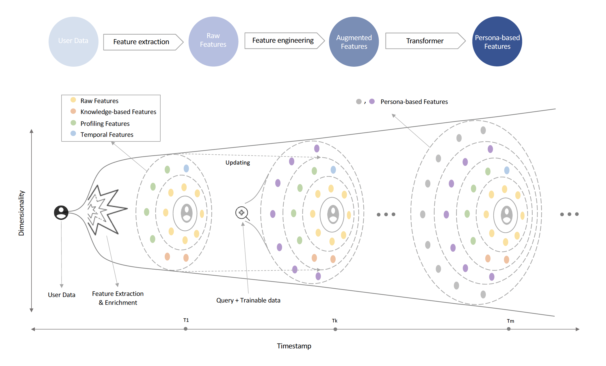
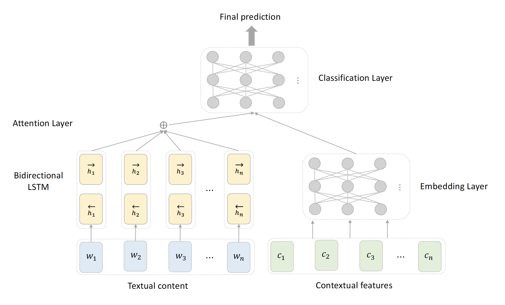
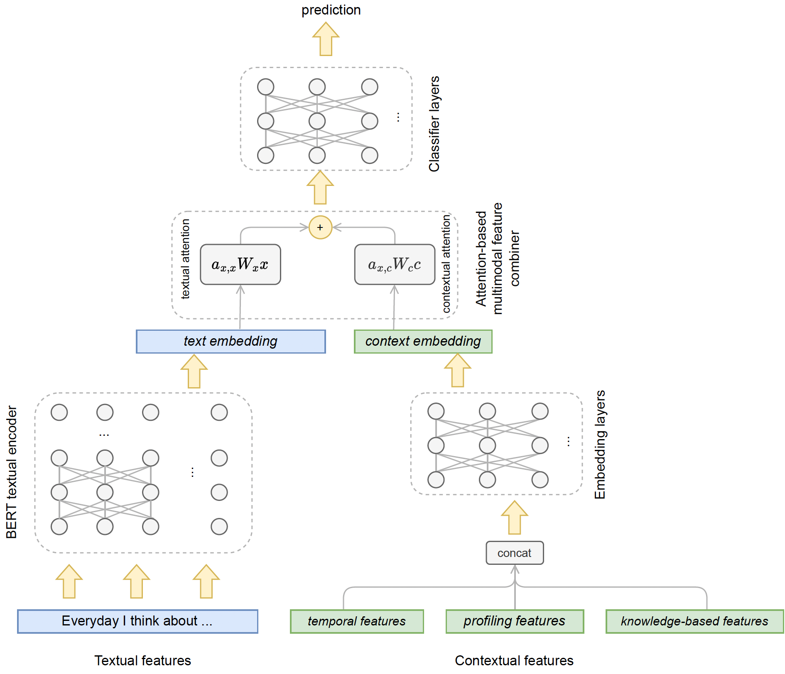

# BigBang
### Title: A Dynamic Approach for Persona Development through Context-Aware, Time-Aware, and Multi-Modal Transformer Analysis


[]()

## Abstract

In user-centred design and marketing, a persona represents a target customer's characteristics, needs, preferences, and behaviours. Constructing customer personas allows organizations to tailor services to meet target audience needs, boosting overall satisfaction. Previous studies explored user profiling through machine learning and filtering techniques and persona development research using qualitative, quantitative, and automated methods. The main challenge in extracting customer activity features for persona development is the complexity of behavioural, contextual comprehension, and potential data biases. To address this challenge, this paper presents a contextualized pipeline to construct, enrich, and augment users' profiles through personas developed by transformers. We introduce a dynamic approach, namely BigBang, that is adaptive to customer behaviour changes, thus addressing the challenge of behavioural variability and the static nature of personas. Contextualization will focus on extracting meaningful and relevant features by considering factors related to the user's previous interactions. Considering temporal aspects, we capture trends, seasonality, and behavioural changes, which are vital for accurate and up-to-date personas. Incorporating Explainable AI(XAI) into our Text-Tabular transformer, we achieve deeper insights into customer behaviour, unveiling latent features and nuances. We evaluate this method with accurate data, demonstrating its effectiveness in transparently analyzing cognitive characteristics for behavioural insights.


## Contributions

- Introducing a dynamic method for persona development, focusing on the interplay between sophisticated user profiling and hybrid transformer supporting both textual and tabular data.
- Adopting XAI principles to bolster transparency and enrich the extraction of insightful patterns within persona development.


## Figures

|  | 
|:----------------------------------------------------------:|
| Fig.1 - User data’s odyssey via the BigBang profiling approach.|


|  |  |
|:----------------------------------------------------------:|:-----------------------------------------------------------:|
| Fig.2 - Deep NN architecture for benchmarking.             | Fig.3 - Transformer architecture for persona development.   |


## Results

| Models                    | Accuracy | Precision | Recall | F-score |
|---------------------------|----------|-----------|--------|---------|
| ML TF-IDF only            | 0.73     | 0.72      | 0.80   | 0.76    |
| ML model multi-modal      | 0.76     | 0.76      | 0.79   | 0.78    |
| Deep NN text-only         | 0.79     | 0.80      | 0.79   | 0.79    |
| Deep NN multi-modal       | 0.80     | 0.80      | 0.82   | 0.81    |
| Transformer text-only     | 0.90     | 0.78      | **0.88** | 0.83    |
| Transformer multi-modal   | **0.91** | **0.80**  | 0.87 | **0.84** |

## Getting Started

#### 1. Clone and Install

```bash
# Clone the repo

git clone https://github.com/salehafzoon/BigBang.git
